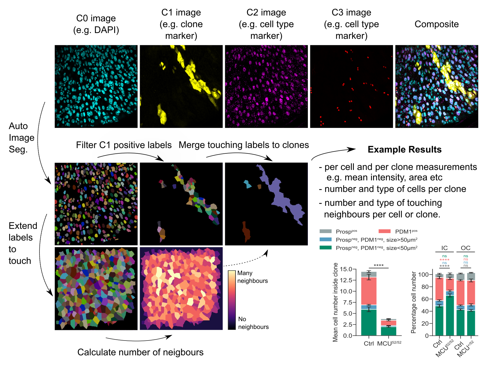

# clonedetective
> A python library for automated cell lineage analysis.

## What does it do?

**clonedetective** is a package for analysing fluorescent imaging data from cell lineage experiments (e.g. FLP-out, MARCM or Cre-lox clones).

Outputted quantifications include:
- counts of each cell type per “clone”
- spatial metrics e.g. number of nearest neighbors of each cell per clone
- cell and clone properties e.g. area, mean intensity etc.

If clones label genetic mutations, these metrics can be useful in addressing biological questions such as:
- does my gene of interest regulate clone size (i.e. cell proliferation) or clone composition (i.e. cell differentiation)?
- does the local cell neighbourhood (e.g. number and type of neighbours) non-autonomously impact cell proliferation or differentiation? 
- does my gene of interest regulate the expression of other (immunostained) proteins?

## Under the hood

**clonedetective** is constructed using many amazing python libraries, including scikit-image, numpy, Xarray, pandas, numba, Dask, Dask-image and pyclesperanto-prototype.

Many functions are lazy-loaded and parallelized using [Dask](https://dask.org/), enabling clonedetective to scale to large multi-dimensional datasets that do not fit in RAM.

## Install

It is recommended to install **clonedetective** into a virtual environment e.g. using [conda](https://docs.conda.io/). Once you have anaconda or miniconda installed, you can create a virtual environment using the following command. It is often helpful to install something into an empty environment, in this case we install scipy:

`conda create -n myenv scipy` 

You can then install clonedetective via pip:

`pip install clonedetective`

## How to use

Please see the tutorials:  
1) [Example walkthrough](https://morriso1.github.io/clonedetective/Tutorial_Walkthrough.html)  
2) [Downstream Analysis using Python](https://morriso1.github.io/clonedetective/Tutorial_Downstream_Analysis_Python.html)  
3) [Downstream Analysis using R](https://morriso1.github.io/clonedetective/Tutorial_Downstream_Analysis_R.html)  
4) [Generating nuclei segmentation using StarDist](https://morriso1.github.io/clonedetective/Tutorial_StarDist_Segmentation.html)  

In progress, more to come!
