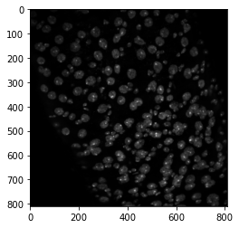

# py_clone_detective
> A python library for automated cell lineage analysis.


## Install

pip install not yet supported but will be soon!

`pip install coming_soon`

## How to use - simple use case

For a more detailed walkthrough, please see individual tutorials.

### Import and instantiate CloneCounter subclass:

The LazyCloneCounter subclass uses Dask to lazy load image series that maybe too large to fit in RAM.

```
from py_clone_detective.clone_counters import LazyCloneCounter
```

We intialise a LazyCloneCounter with four required arguments:
1) **exp_name** : str -> name of the experiment
2) **img_name_regex** : str -> regular expression used to extract unique identifies from image filenames
3) **pixel_size** : str -> pixel size in $\mu m^{2}$
4) **tot_seg_ch** : str -> image channel used to define the total number of cells e.g. DAPI channel.

```
exp = LazyCloneCounter(
    exp_name="Marcm2a_E7F1",
    img_name_regex=r"a\dg\d\dp\d",
    pixel_size=0.275,
    tot_seg_ch="C0",
)
```

### Load images and segmentations

We add images to the LazyCloneCounter instance by passing filename "glob" for each of the image channel.

In this experiment, there are four image channels:

- C0 : DAPI (nuclear marker)
- C1 : GFP (clone marker)
- C2 : PDM1 staining (EnteroCyte marker)
- C3 : Prospero staining (EndoEndocrine marker)

```
exp.add_images(
    C0="data/MARCM_experiment/images/C0/*.tif",
    C1="data/MARCM_experiment/images/C1/*.tif",
    C2="data/MARCM_experiment/images/C2/*.tif",
    C3="data/MARCM_experiment/images/C3/*.tif",
)
```

Image data is stored in an Xarray dataset:

```
exp.image_data
```


<div><svg style="position: absolute; width: 0; height: 0; overflow: hidden">
<defs>
<symbol id="icon-database" viewBox="0 0 32 32">
<path d="M16 0c-8.837 0-16 2.239-16 5v4c0 2.761 7.163 5 16 5s16-2.239 16-5v-4c0-2.761-7.163-5-16-5z"></path>
<path d="M16 17c-8.837 0-16-2.239-16-5v6c0 2.761 7.163 5 16 5s16-2.239 16-5v-6c0 2.761-7.163 5-16 5z"></path>
<path d="M16 26c-8.837 0-16-2.239-16-5v6c0 2.761 7.163 5 16 5s16-2.239 16-5v-6c0 2.761-7.163 5-16 5z"></path>
</symbol>
<symbol id="icon-file-text2" viewBox="0 0 32 32">
<path d="M28.681 7.159c-0.694-0.947-1.662-2.053-2.724-3.116s-2.169-2.030-3.116-2.724c-1.612-1.182-2.393-1.319-2.841-1.319h-15.5c-1.378 0-2.5 1.121-2.5 2.5v27c0 1.378 1.122 2.5 2.5 2.5h23c1.378 0 2.5-1.122 2.5-2.5v-19.5c0-0.448-0.137-1.23-1.319-2.841zM24.543 5.457c0.959 0.959 1.712 1.825 2.268 2.543h-4.811v-4.811c0.718 0.556 1.584 1.309 2.543 2.268zM28 29.5c0 0.271-0.229 0.5-0.5 0.5h-23c-0.271 0-0.5-0.229-0.5-0.5v-27c0-0.271 0.229-0.5 0.5-0.5 0 0 15.499-0 15.5 0v7c0 0.552 0.448 1 1 1h7v19.5z"></path>
<path d="M23 26h-14c-0.552 0-1-0.448-1-1s0.448-1 1-1h14c0.552 0 1 0.448 1 1s-0.448 1-1 1z"></path>
<path d="M23 22h-14c-0.552 0-1-0.448-1-1s0.448-1 1-1h14c0.552 0 1 0.448 1 1s-0.448 1-1 1z"></path>
<path d="M23 18h-14c-0.552 0-1-0.448-1-1s0.448-1 1-1h14c0.552 0 1 0.448 1 1s-0.448 1-1 1z"></path>
</symbol>
</defs>
</svg>
<style>/* CSS stylesheet for displaying xarray objects in jupyterlab.
 *
 */

:root {
  --xr-font-color0: var(--jp-content-font-color0, rgba(0, 0, 0, 1));
  --xr-font-color2: var(--jp-content-font-color2, rgba(0, 0, 0, 0.54));
  --xr-font-color3: var(--jp-content-font-color3, rgba(0, 0, 0, 0.38));
  --xr-border-color: var(--jp-border-color2, #e0e0e0);
  --xr-disabled-color: var(--jp-layout-color3, #bdbdbd);
  --xr-background-color: var(--jp-layout-color0, white);
  --xr-background-color-row-even: var(--jp-layout-color1, white);
  --xr-background-color-row-odd: var(--jp-layout-color2, #eeeeee);
}

html[theme=dark],
body.vscode-dark {
  --xr-font-color0: rgba(255, 255, 255, 1);
  --xr-font-color2: rgba(255, 255, 255, 0.54);
  --xr-font-color3: rgba(255, 255, 255, 0.38);
  --xr-border-color: #1F1F1F;
  --xr-disabled-color: #515151;
  --xr-background-color: #111111;
  --xr-background-color-row-even: #111111;
  --xr-background-color-row-odd: #313131;
}

.xr-wrap {
  display: block;
  min-width: 300px;
  max-width: 700px;
}

.xr-text-repr-fallback {
  /* fallback to plain text repr when CSS is not injected (untrusted notebook) */
  display: none;
}

.xr-header {
  padding-top: 6px;
  padding-bottom: 6px;
  margin-bottom: 4px;
  border-bottom: solid 1px var(--xr-border-color);
}

.xr-header > div,
.xr-header > ul {
  display: inline;
  margin-top: 0;
  margin-bottom: 0;
}

.xr-obj-type,
.xr-array-name {
  margin-left: 2px;
  margin-right: 10px;
}

.xr-obj-type {
  color: var(--xr-font-color2);
}

.xr-sections {
  padding-left: 0 !important;
  display: grid;
  grid-template-columns: 150px auto auto 1fr 20px 20px;
}

.xr-section-item {
  display: contents;
}

.xr-section-item input {
  display: none;
}

.xr-section-item input + label {
  color: var(--xr-disabled-color);
}

.xr-section-item input:enabled + label {
  cursor: pointer;
  color: var(--xr-font-color2);
}

.xr-section-item input:enabled + label:hover {
  color: var(--xr-font-color0);
}

.xr-section-summary {
  grid-column: 1;
  color: var(--xr-font-color2);
  font-weight: 500;
}

.xr-section-summary > span {
  display: inline-block;
  padding-left: 0.5em;
}

.xr-section-summary-in:disabled + label {
  color: var(--xr-font-color2);
}

.xr-section-summary-in + label:before {
  display: inline-block;
  content: '►';
  font-size: 11px;
  width: 15px;
  text-align: center;
}

.xr-section-summary-in:disabled + label:before {
  color: var(--xr-disabled-color);
}

.xr-section-summary-in:checked + label:before {
  content: '▼';
}

.xr-section-summary-in:checked + label > span {
  display: none;
}

.xr-section-summary,
.xr-section-inline-details {
  padding-top: 4px;
  padding-bottom: 4px;
}

.xr-section-inline-details {
  grid-column: 2 / -1;
}

.xr-section-details {
  display: none;
  grid-column: 1 / -1;
  margin-bottom: 5px;
}

.xr-section-summary-in:checked ~ .xr-section-details {
  display: contents;
}

.xr-array-wrap {
  grid-column: 1 / -1;
  display: grid;
  grid-template-columns: 20px auto;
}

.xr-array-wrap > label {
  grid-column: 1;
  vertical-align: top;
}

.xr-preview {
  color: var(--xr-font-color3);
}

.xr-array-preview,
.xr-array-data {
  padding: 0 5px !important;
  grid-column: 2;
}

.xr-array-data,
.xr-array-in:checked ~ .xr-array-preview {
  display: none;
}

.xr-array-in:checked ~ .xr-array-data,
.xr-array-preview {
  display: inline-block;
}

.xr-dim-list {
  display: inline-block !important;
  list-style: none;
  padding: 0 !important;
  margin: 0;
}

.xr-dim-list li {
  display: inline-block;
  padding: 0;
  margin: 0;
}

.xr-dim-list:before {
  content: '(';
}

.xr-dim-list:after {
  content: ')';
}

.xr-dim-list li:not(:last-child):after {
  content: ',';
  padding-right: 5px;
}

.xr-has-index {
  font-weight: bold;
}

.xr-var-list,
.xr-var-item {
  display: contents;
}

.xr-var-item > div,
.xr-var-item label,
.xr-var-item > .xr-var-name span {
  background-color: var(--xr-background-color-row-even);
  margin-bottom: 0;
}

.xr-var-item > .xr-var-name:hover span {
  padding-right: 5px;
}

.xr-var-list > li:nth-child(odd) > div,
.xr-var-list > li:nth-child(odd) > label,
.xr-var-list > li:nth-child(odd) > .xr-var-name span {
  background-color: var(--xr-background-color-row-odd);
}

.xr-var-name {
  grid-column: 1;
}

.xr-var-dims {
  grid-column: 2;
}

.xr-var-dtype {
  grid-column: 3;
  text-align: right;
  color: var(--xr-font-color2);
}

.xr-var-preview {
  grid-column: 4;
}

.xr-var-name,
.xr-var-dims,
.xr-var-dtype,
.xr-preview,
.xr-attrs dt {
  white-space: nowrap;
  overflow: hidden;
  text-overflow: ellipsis;
  padding-right: 10px;
}

.xr-var-name:hover,
.xr-var-dims:hover,
.xr-var-dtype:hover,
.xr-attrs dt:hover {
  overflow: visible;
  width: auto;
  z-index: 1;
}

.xr-var-attrs,
.xr-var-data {
  display: none;
  background-color: var(--xr-background-color) !important;
  padding-bottom: 5px !important;
}

.xr-var-attrs-in:checked ~ .xr-var-attrs,
.xr-var-data-in:checked ~ .xr-var-data {
  display: block;
}

.xr-var-data > table {
  float: right;
}

.xr-var-name span,
.xr-var-data,
.xr-attrs {
  padding-left: 25px !important;
}

.xr-attrs,
.xr-var-attrs,
.xr-var-data {
  grid-column: 1 / -1;
}

dl.xr-attrs {
  padding: 0;
  margin: 0;
  display: grid;
  grid-template-columns: 125px auto;
}

.xr-attrs dt,
.xr-attrs dd {
  padding: 0;
  margin: 0;
  float: left;
  padding-right: 10px;
  width: auto;
}

.xr-attrs dt {
  font-weight: normal;
  grid-column: 1;
}

.xr-attrs dt:hover span {
  display: inline-block;
  background: var(--xr-background-color);
  padding-right: 10px;
}

.xr-attrs dd {
  grid-column: 2;
  white-space: pre-wrap;
  word-break: break-all;
}

.xr-icon-database,
.xr-icon-file-text2 {
  display: inline-block;
  vertical-align: middle;
  width: 1em;
  height: 1.5em !important;
  stroke-width: 0;
  stroke: currentColor;
  fill: currentColor;
}
</style><pre class='xr-text-repr-fallback'>&lt;xarray.Dataset&gt;
Dimensions:       (img_channels: 4, img_name: 67, x: 810, y: 810)
Coordinates:
  * img_channels  (img_channels) &lt;U2 &#x27;C0&#x27; &#x27;C1&#x27; &#x27;C2&#x27; &#x27;C3&#x27;
  * img_name      (img_name) &lt;U7 &#x27;a1g01p1&#x27; &#x27;a1g01p2&#x27; ... &#x27;a2g13p2&#x27; &#x27;a2g13p3&#x27;
  * y             (y) float64 0.0 0.275 0.55 0.825 ... 221.7 221.9 222.2 222.5
  * x             (x) float64 0.0 0.275 0.55 0.825 ... 221.7 221.9 222.2 222.5
Data variables:
    images        (img_channels, img_name, y, x) uint16 dask.array&lt;chunksize=(1, 1, 810, 810), meta=np.ndarray&gt;</pre><div class='xr-wrap' hidden><div class='xr-header'><div class='xr-obj-type'>xarray.Dataset</div></div><ul class='xr-sections'><li class='xr-section-item'><input id='section-ab19f89f-c47f-45fe-90bc-5b73854612f9' class='xr-section-summary-in' type='checkbox' disabled ><label for='section-ab19f89f-c47f-45fe-90bc-5b73854612f9' class='xr-section-summary'  title='Expand/collapse section'>Dimensions:</label><div class='xr-section-inline-details'><ul class='xr-dim-list'><li><span class='xr-has-index'>img_channels</span>: 4</li><li><span class='xr-has-index'>img_name</span>: 67</li><li><span class='xr-has-index'>x</span>: 810</li><li><span class='xr-has-index'>y</span>: 810</li></ul></div><div class='xr-section-details'></div></li><li class='xr-section-item'><input id='section-d723dd65-c93d-442b-befa-a1bc7745f996' class='xr-section-summary-in' type='checkbox'  checked><label for='section-d723dd65-c93d-442b-befa-a1bc7745f996' class='xr-section-summary' >Coordinates: <span>(4)</span></label><div class='xr-section-inline-details'></div><div class='xr-section-details'><ul class='xr-var-list'><li class='xr-var-item'><div class='xr-var-name'><span class='xr-has-index'>img_channels</span></div><div class='xr-var-dims'>(img_channels)</div><div class='xr-var-dtype'>&lt;U2</div><div class='xr-var-preview xr-preview'>&#x27;C0&#x27; &#x27;C1&#x27; &#x27;C2&#x27; &#x27;C3&#x27;</div><input id='attrs-4b563609-8c59-4ad2-8c00-d2f41ae7a3b9' class='xr-var-attrs-in' type='checkbox' disabled><label for='attrs-4b563609-8c59-4ad2-8c00-d2f41ae7a3b9' title='Show/Hide attributes'><svg class='icon xr-icon-file-text2'><use xlink:href='#icon-file-text2'></use></svg></label><input id='data-974be0e0-c881-4437-aaf4-8336119028ca' class='xr-var-data-in' type='checkbox'><label for='data-974be0e0-c881-4437-aaf4-8336119028ca' title='Show/Hide data repr'><svg class='icon xr-icon-database'><use xlink:href='#icon-database'></use></svg></label><div class='xr-var-attrs'><dl class='xr-attrs'></dl></div><div class='xr-var-data'><pre>array([&#x27;C0&#x27;, &#x27;C1&#x27;, &#x27;C2&#x27;, &#x27;C3&#x27;], dtype=&#x27;&lt;U2&#x27;)</pre></div></li><li class='xr-var-item'><div class='xr-var-name'><span class='xr-has-index'>img_name</span></div><div class='xr-var-dims'>(img_name)</div><div class='xr-var-dtype'>&lt;U7</div><div class='xr-var-preview xr-preview'>&#x27;a1g01p1&#x27; &#x27;a1g01p2&#x27; ... &#x27;a2g13p3&#x27;</div><input id='attrs-fecffbb9-8157-45ed-8e07-a6e00434ef37' class='xr-var-attrs-in' type='checkbox' disabled><label for='attrs-fecffbb9-8157-45ed-8e07-a6e00434ef37' title='Show/Hide attributes'><svg class='icon xr-icon-file-text2'><use xlink:href='#icon-file-text2'></use></svg></label><input id='data-fedca920-40eb-4b8a-878e-e28ee45b4dc8' class='xr-var-data-in' type='checkbox'><label for='data-fedca920-40eb-4b8a-878e-e28ee45b4dc8' title='Show/Hide data repr'><svg class='icon xr-icon-database'><use xlink:href='#icon-database'></use></svg></label><div class='xr-var-attrs'><dl class='xr-attrs'></dl></div><div class='xr-var-data'><pre>array([&#x27;a1g01p1&#x27;, &#x27;a1g01p2&#x27;, &#x27;a1g01p3&#x27;, &#x27;a1g02p1&#x27;, &#x27;a1g02p2&#x27;, &#x27;a1g02p3&#x27;,
       &#x27;a1g03p1&#x27;, &#x27;a1g03p2&#x27;, &#x27;a1g03p3&#x27;, &#x27;a1g04p1&#x27;, &#x27;a1g04p2&#x27;, &#x27;a1g04p3&#x27;,
       &#x27;a1g05p1&#x27;, &#x27;a1g05p2&#x27;, &#x27;a1g05p3&#x27;, &#x27;a1g07p1&#x27;, &#x27;a1g07p2&#x27;, &#x27;a1g08p1&#x27;,
       &#x27;a1g08p2&#x27;, &#x27;a1g08p3&#x27;, &#x27;a1g09p1&#x27;, &#x27;a1g09p2&#x27;, &#x27;a1g09p3&#x27;, &#x27;a1g10p1&#x27;,
       &#x27;a1g11p1&#x27;, &#x27;a1g11p2&#x27;, &#x27;a1g11p3&#x27;, &#x27;a1g12p1&#x27;, &#x27;a1g12p2&#x27;, &#x27;a1g13p1&#x27;,
       &#x27;a1g14p1&#x27;, &#x27;a1g15p1&#x27;, &#x27;a1g15p2&#x27;, &#x27;a1g15p3&#x27;, &#x27;a2g01p1&#x27;, &#x27;a2g01p2&#x27;,
       &#x27;a2g01p3&#x27;, &#x27;a2g02p1&#x27;, &#x27;a2g02p2&#x27;, &#x27;a2g03p1&#x27;, &#x27;a2g03p2&#x27;, &#x27;a2g03p3&#x27;,
       &#x27;a2g04p1&#x27;, &#x27;a2g04p2&#x27;, &#x27;a2g05p1&#x27;, &#x27;a2g05p2&#x27;, &#x27;a2g05p3&#x27;, &#x27;a2g06p1&#x27;,
       &#x27;a2g06p2&#x27;, &#x27;a2g06p3&#x27;, &#x27;a2g07p1&#x27;, &#x27;a2g07p2&#x27;, &#x27;a2g07p3&#x27;, &#x27;a2g08p1&#x27;,
       &#x27;a2g08p3&#x27;, &#x27;a2g09p1&#x27;, &#x27;a2g09p2&#x27;, &#x27;a2g09p3&#x27;, &#x27;a2g10p1&#x27;, &#x27;a2g10p2&#x27;,
       &#x27;a2g10p3&#x27;, &#x27;a2g11p1&#x27;, &#x27;a2g11p3&#x27;, &#x27;a2g12p1&#x27;, &#x27;a2g12p2&#x27;, &#x27;a2g13p2&#x27;,
       &#x27;a2g13p3&#x27;], dtype=&#x27;&lt;U7&#x27;)</pre></div></li><li class='xr-var-item'><div class='xr-var-name'><span class='xr-has-index'>y</span></div><div class='xr-var-dims'>(y)</div><div class='xr-var-dtype'>float64</div><div class='xr-var-preview xr-preview'>0.0 0.275 0.55 ... 222.2 222.5</div><input id='attrs-edeb665a-2c59-4ade-bd13-8d65a8b5174d' class='xr-var-attrs-in' type='checkbox' disabled><label for='attrs-edeb665a-2c59-4ade-bd13-8d65a8b5174d' title='Show/Hide attributes'><svg class='icon xr-icon-file-text2'><use xlink:href='#icon-file-text2'></use></svg></label><input id='data-8ef098e2-c47c-4780-b6c9-c12f06d8031c' class='xr-var-data-in' type='checkbox'><label for='data-8ef098e2-c47c-4780-b6c9-c12f06d8031c' title='Show/Hide data repr'><svg class='icon xr-icon-database'><use xlink:href='#icon-database'></use></svg></label><div class='xr-var-attrs'><dl class='xr-attrs'></dl></div><div class='xr-var-data'><pre>array([  0.   ,   0.275,   0.55 , ..., 221.925, 222.2  , 222.475])</pre></div></li><li class='xr-var-item'><div class='xr-var-name'><span class='xr-has-index'>x</span></div><div class='xr-var-dims'>(x)</div><div class='xr-var-dtype'>float64</div><div class='xr-var-preview xr-preview'>0.0 0.275 0.55 ... 222.2 222.5</div><input id='attrs-43e229d5-a055-44c8-a82e-e75e31f99827' class='xr-var-attrs-in' type='checkbox' disabled><label for='attrs-43e229d5-a055-44c8-a82e-e75e31f99827' title='Show/Hide attributes'><svg class='icon xr-icon-file-text2'><use xlink:href='#icon-file-text2'></use></svg></label><input id='data-fa5b97f5-1ad3-4550-a762-1bd144de070a' class='xr-var-data-in' type='checkbox'><label for='data-fa5b97f5-1ad3-4550-a762-1bd144de070a' title='Show/Hide data repr'><svg class='icon xr-icon-database'><use xlink:href='#icon-database'></use></svg></label><div class='xr-var-attrs'><dl class='xr-attrs'></dl></div><div class='xr-var-data'><pre>array([  0.   ,   0.275,   0.55 , ..., 221.925, 222.2  , 222.475])</pre></div></li></ul></div></li><li class='xr-section-item'><input id='section-2418eff7-83ad-4eda-b53c-5336d68793dc' class='xr-section-summary-in' type='checkbox'  checked><label for='section-2418eff7-83ad-4eda-b53c-5336d68793dc' class='xr-section-summary' >Data variables: <span>(1)</span></label><div class='xr-section-inline-details'></div><div class='xr-section-details'><ul class='xr-var-list'><li class='xr-var-item'><div class='xr-var-name'><span>images</span></div><div class='xr-var-dims'>(img_channels, img_name, y, x)</div><div class='xr-var-dtype'>uint16</div><div class='xr-var-preview xr-preview'>dask.array&lt;chunksize=(1, 1, 810, 810), meta=np.ndarray&gt;</div><input id='attrs-14d2dffd-7d42-4190-ae6d-d5e8bd980ce7' class='xr-var-attrs-in' type='checkbox' disabled><label for='attrs-14d2dffd-7d42-4190-ae6d-d5e8bd980ce7' title='Show/Hide attributes'><svg class='icon xr-icon-file-text2'><use xlink:href='#icon-file-text2'></use></svg></label><input id='data-7106cb17-51f1-4fb5-80ab-1cd99443f9f9' class='xr-var-data-in' type='checkbox'><label for='data-7106cb17-51f1-4fb5-80ab-1cd99443f9f9' title='Show/Hide data repr'><svg class='icon xr-icon-database'><use xlink:href='#icon-database'></use></svg></label><div class='xr-var-attrs'><dl class='xr-attrs'></dl></div><div class='xr-var-data'><table>
<tr>
<td>
<table>
  <thead>
    <tr><td> </td><th> Array </th><th> Chunk </th></tr>
  </thead>
  <tbody>
    <tr><th> Bytes </th><td> 335.38 MiB </td> <td> 1.25 MiB </td></tr>
    <tr><th> Shape </th><td> (4, 67, 810, 810) </td> <td> (1, 1, 810, 810) </td></tr>
    <tr><th> Count </th><td> 1072 Tasks </td><td> 268 Chunks </td></tr>
    <tr><th> Type </th><td> uint16 </td><td> numpy.ndarray </td></tr>
  </tbody>
</table>
</td>
<td>
<svg width="382" height="192" style="stroke:rgb(0,0,0);stroke-width:1" >

  <!-- Horizontal lines -->
  <line x1="0" y1="0" x2="25" y2="0" style="stroke-width:2" />
  <line x1="0" y1="25" x2="25" y2="25" style="stroke-width:2" />

  <!-- Vertical lines -->
  <line x1="0" y1="0" x2="0" y2="25" style="stroke-width:2" />
  <line x1="6" y1="0" x2="6" y2="25" />
  <line x1="12" y1="0" x2="12" y2="25" />
  <line x1="19" y1="0" x2="19" y2="25" />
  <line x1="25" y1="0" x2="25" y2="25" style="stroke-width:2" />

  <!-- Colored Rectangle -->
  <polygon points="0.0,0.0 25.412616514582485,0.0 25.412616514582485,25.412616514582485 0.0,25.412616514582485" style="fill:#ECB172A0;stroke-width:0"/>

  <!-- Text -->
  <text x="12.706308" y="45.412617" font-size="1.0rem" font-weight="100" text-anchor="middle" >4</text>
  <text x="45.412617" y="12.706308" font-size="1.0rem" font-weight="100" text-anchor="middle" transform="rotate(0,45.412617,12.706308)">1</text>


  <!-- Horizontal lines -->
  <line x1="95" y1="0" x2="117" y2="22" style="stroke-width:2" />
  <line x1="95" y1="120" x2="117" y2="142" style="stroke-width:2" />

  <!-- Vertical lines -->
  <line x1="95" y1="0" x2="95" y2="120" style="stroke-width:2" />
  <line x1="95" y1="0" x2="95" y2="120" />
  <line x1="96" y1="1" x2="96" y2="121" />
  <line x1="96" y1="1" x2="96" y2="121" />
  <line x1="97" y1="2" x2="97" y2="122" />
  <line x1="98" y1="3" x2="98" y2="123" />
  <line x1="98" y1="3" x2="98" y2="123" />
  <line x1="99" y1="4" x2="99" y2="124" />
  <line x1="100" y1="5" x2="100" y2="125" />
  <line x1="100" y1="5" x2="100" y2="125" />
  <line x1="101" y1="6" x2="101" y2="126" />
  <line x1="102" y1="7" x2="102" y2="127" />
  <line x1="103" y1="8" x2="103" y2="128" />
  <line x1="103" y1="8" x2="103" y2="128" />
  <line x1="104" y1="9" x2="104" y2="129" />
  <line x1="105" y1="10" x2="105" y2="130" />
  <line x1="105" y1="10" x2="105" y2="130" />
  <line x1="106" y1="11" x2="106" y2="131" />
  <line x1="107" y1="12" x2="107" y2="132" />
  <line x1="107" y1="12" x2="107" y2="132" />
  <line x1="108" y1="13" x2="108" y2="133" />
  <line x1="109" y1="14" x2="109" y2="134" />
  <line x1="110" y1="15" x2="110" y2="135" />
  <line x1="110" y1="15" x2="110" y2="135" />
  <line x1="111" y1="16" x2="111" y2="136" />
  <line x1="112" y1="17" x2="112" y2="137" />
  <line x1="112" y1="17" x2="112" y2="137" />
  <line x1="113" y1="18" x2="113" y2="138" />
  <line x1="114" y1="19" x2="114" y2="139" />
  <line x1="114" y1="19" x2="114" y2="139" />
  <line x1="115" y1="20" x2="115" y2="140" />
  <line x1="116" y1="21" x2="116" y2="141" />
  <line x1="117" y1="22" x2="117" y2="142" style="stroke-width:2" />

  <!-- Colored Rectangle -->
  <polygon points="95.0,0.0 117.0709170996805,22.0709170996805 117.0709170996805,142.0709170996805 95.0,120.0" style="fill:#8B4903A0;stroke-width:0"/>

  <!-- Horizontal lines -->
  <line x1="95" y1="0" x2="215" y2="0" style="stroke-width:2" />
  <line x1="95" y1="0" x2="215" y2="0" />
  <line x1="96" y1="1" x2="216" y2="1" />
  <line x1="96" y1="1" x2="216" y2="1" />
  <line x1="97" y1="2" x2="217" y2="2" />
  <line x1="98" y1="3" x2="218" y2="3" />
  <line x1="98" y1="3" x2="218" y2="3" />
  <line x1="99" y1="4" x2="219" y2="4" />
  <line x1="100" y1="5" x2="220" y2="5" />
  <line x1="100" y1="5" x2="220" y2="5" />
  <line x1="101" y1="6" x2="221" y2="6" />
  <line x1="102" y1="7" x2="222" y2="7" />
  <line x1="103" y1="8" x2="223" y2="8" />
  <line x1="103" y1="8" x2="223" y2="8" />
  <line x1="104" y1="9" x2="224" y2="9" />
  <line x1="105" y1="10" x2="225" y2="10" />
  <line x1="105" y1="10" x2="225" y2="10" />
  <line x1="106" y1="11" x2="226" y2="11" />
  <line x1="107" y1="12" x2="227" y2="12" />
  <line x1="107" y1="12" x2="227" y2="12" />
  <line x1="108" y1="13" x2="228" y2="13" />
  <line x1="109" y1="14" x2="229" y2="14" />
  <line x1="110" y1="15" x2="230" y2="15" />
  <line x1="110" y1="15" x2="230" y2="15" />
  <line x1="111" y1="16" x2="231" y2="16" />
  <line x1="112" y1="17" x2="232" y2="17" />
  <line x1="112" y1="17" x2="232" y2="17" />
  <line x1="113" y1="18" x2="233" y2="18" />
  <line x1="114" y1="19" x2="234" y2="19" />
  <line x1="114" y1="19" x2="234" y2="19" />
  <line x1="115" y1="20" x2="235" y2="20" />
  <line x1="116" y1="21" x2="236" y2="21" />
  <line x1="117" y1="22" x2="237" y2="22" style="stroke-width:2" />

  <!-- Vertical lines -->
  <line x1="95" y1="0" x2="117" y2="22" style="stroke-width:2" />
  <line x1="215" y1="0" x2="237" y2="22" style="stroke-width:2" />

  <!-- Colored Rectangle -->
  <polygon points="95.0,0.0 215.0,0.0 237.0709170996805,22.0709170996805 117.0709170996805,22.0709170996805" style="fill:#8B4903A0;stroke-width:0"/>

  <!-- Horizontal lines -->
  <line x1="117" y1="22" x2="237" y2="22" style="stroke-width:2" />
  <line x1="117" y1="142" x2="237" y2="142" style="stroke-width:2" />

  <!-- Vertical lines -->
  <line x1="117" y1="22" x2="117" y2="142" style="stroke-width:2" />
  <line x1="237" y1="22" x2="237" y2="142" style="stroke-width:2" />

  <!-- Colored Rectangle -->
  <polygon points="117.0709170996805,22.0709170996805 237.0709170996805,22.0709170996805 237.0709170996805,142.0709170996805 117.0709170996805,142.0709170996805" style="fill:#ECB172A0;stroke-width:0"/>

  <!-- Text -->
  <text x="177.070917" y="162.070917" font-size="1.0rem" font-weight="100" text-anchor="middle" >810</text>
  <text x="257.070917" y="82.070917" font-size="1.0rem" font-weight="100" text-anchor="middle" transform="rotate(-90,257.070917,82.070917)">810</text>
  <text x="96.035459" y="151.035459" font-size="1.0rem" font-weight="100" text-anchor="middle" transform="rotate(45,96.035459,151.035459)">67</text>
</svg>
</td>
</tr>
</table></div></li></ul></div></li><li class='xr-section-item'><input id='section-9469bfa6-4e74-490f-9616-c03cab8601e0' class='xr-section-summary-in' type='checkbox' disabled ><label for='section-9469bfa6-4e74-490f-9616-c03cab8601e0' class='xr-section-summary'  title='Expand/collapse section'>Attributes: <span>(0)</span></label><div class='xr-section-inline-details'></div><div class='xr-section-details'><dl class='xr-attrs'></dl></div></li></ul></div></div>


We can access specific images using the ".sel" notation. In the example below, we index an image, load it into RAM (compute), and display it using matplotlib.

```
import matplotlib.pyplot as plt

plt.imshow(
    exp.image_data["images"].sel(img_channels="C0", img_name="a1g01p1").compute(),
    cmap="gray",
)
```


    <matplotlib.image.AxesImage at 0x7fe869e950d0>





We can segmentations in the same fashion...

**N.B.** 
At a minimum, py_clone_detector requires a segmentation for the "tot_seg_ch" (see above for definition). If you do not have a suitable segmentation, check out the example tutorial using StarDist.

```
exp.add_segmentations(C0="data/MARCM_experiment/segmentations/C0_stardist_segs/*.tif")
```

Segmentations have now been added to the Xarray dataset:

```
exp.image_data
```


<div><svg style="position: absolute; width: 0; height: 0; overflow: hidden">
<defs>
<symbol id="icon-database" viewBox="0 0 32 32">
<path d="M16 0c-8.837 0-16 2.239-16 5v4c0 2.761 7.163 5 16 5s16-2.239 16-5v-4c0-2.761-7.163-5-16-5z"></path>
<path d="M16 17c-8.837 0-16-2.239-16-5v6c0 2.761 7.163 5 16 5s16-2.239 16-5v-6c0 2.761-7.163 5-16 5z"></path>
<path d="M16 26c-8.837 0-16-2.239-16-5v6c0 2.761 7.163 5 16 5s16-2.239 16-5v-6c0 2.761-7.163 5-16 5z"></path>
</symbol>
<symbol id="icon-file-text2" viewBox="0 0 32 32">
<path d="M28.681 7.159c-0.694-0.947-1.662-2.053-2.724-3.116s-2.169-2.030-3.116-2.724c-1.612-1.182-2.393-1.319-2.841-1.319h-15.5c-1.378 0-2.5 1.121-2.5 2.5v27c0 1.378 1.122 2.5 2.5 2.5h23c1.378 0 2.5-1.122 2.5-2.5v-19.5c0-0.448-0.137-1.23-1.319-2.841zM24.543 5.457c0.959 0.959 1.712 1.825 2.268 2.543h-4.811v-4.811c0.718 0.556 1.584 1.309 2.543 2.268zM28 29.5c0 0.271-0.229 0.5-0.5 0.5h-23c-0.271 0-0.5-0.229-0.5-0.5v-27c0-0.271 0.229-0.5 0.5-0.5 0 0 15.499-0 15.5 0v7c0 0.552 0.448 1 1 1h7v19.5z"></path>
<path d="M23 26h-14c-0.552 0-1-0.448-1-1s0.448-1 1-1h14c0.552 0 1 0.448 1 1s-0.448 1-1 1z"></path>
<path d="M23 22h-14c-0.552 0-1-0.448-1-1s0.448-1 1-1h14c0.552 0 1 0.448 1 1s-0.448 1-1 1z"></path>
<path d="M23 18h-14c-0.552 0-1-0.448-1-1s0.448-1 1-1h14c0.552 0 1 0.448 1 1s-0.448 1-1 1z"></path>
</symbol>
</defs>
</svg>
<style>/* CSS stylesheet for displaying xarray objects in jupyterlab.
 *
 */

:root {
  --xr-font-color0: var(--jp-content-font-color0, rgba(0, 0, 0, 1));
  --xr-font-color2: var(--jp-content-font-color2, rgba(0, 0, 0, 0.54));
  --xr-font-color3: var(--jp-content-font-color3, rgba(0, 0, 0, 0.38));
  --xr-border-color: var(--jp-border-color2, #e0e0e0);
  --xr-disabled-color: var(--jp-layout-color3, #bdbdbd);
  --xr-background-color: var(--jp-layout-color0, white);
  --xr-background-color-row-even: var(--jp-layout-color1, white);
  --xr-background-color-row-odd: var(--jp-layout-color2, #eeeeee);
}

html[theme=dark],
body.vscode-dark {
  --xr-font-color0: rgba(255, 255, 255, 1);
  --xr-font-color2: rgba(255, 255, 255, 0.54);
  --xr-font-color3: rgba(255, 255, 255, 0.38);
  --xr-border-color: #1F1F1F;
  --xr-disabled-color: #515151;
  --xr-background-color: #111111;
  --xr-background-color-row-even: #111111;
  --xr-background-color-row-odd: #313131;
}

.xr-wrap {
  display: block;
  min-width: 300px;
  max-width: 700px;
}

.xr-text-repr-fallback {
  /* fallback to plain text repr when CSS is not injected (untrusted notebook) */
  display: none;
}

.xr-header {
  padding-top: 6px;
  padding-bottom: 6px;
  margin-bottom: 4px;
  border-bottom: solid 1px var(--xr-border-color);
}

.xr-header > div,
.xr-header > ul {
  display: inline;
  margin-top: 0;
  margin-bottom: 0;
}

.xr-obj-type,
.xr-array-name {
  margin-left: 2px;
  margin-right: 10px;
}

.xr-obj-type {
  color: var(--xr-font-color2);
}

.xr-sections {
  padding-left: 0 !important;
  display: grid;
  grid-template-columns: 150px auto auto 1fr 20px 20px;
}

.xr-section-item {
  display: contents;
}

.xr-section-item input {
  display: none;
}

.xr-section-item input + label {
  color: var(--xr-disabled-color);
}

.xr-section-item input:enabled + label {
  cursor: pointer;
  color: var(--xr-font-color2);
}

.xr-section-item input:enabled + label:hover {
  color: var(--xr-font-color0);
}

.xr-section-summary {
  grid-column: 1;
  color: var(--xr-font-color2);
  font-weight: 500;
}

.xr-section-summary > span {
  display: inline-block;
  padding-left: 0.5em;
}

.xr-section-summary-in:disabled + label {
  color: var(--xr-font-color2);
}

.xr-section-summary-in + label:before {
  display: inline-block;
  content: '►';
  font-size: 11px;
  width: 15px;
  text-align: center;
}

.xr-section-summary-in:disabled + label:before {
  color: var(--xr-disabled-color);
}

.xr-section-summary-in:checked + label:before {
  content: '▼';
}

.xr-section-summary-in:checked + label > span {
  display: none;
}

.xr-section-summary,
.xr-section-inline-details {
  padding-top: 4px;
  padding-bottom: 4px;
}

.xr-section-inline-details {
  grid-column: 2 / -1;
}

.xr-section-details {
  display: none;
  grid-column: 1 / -1;
  margin-bottom: 5px;
}

.xr-section-summary-in:checked ~ .xr-section-details {
  display: contents;
}

.xr-array-wrap {
  grid-column: 1 / -1;
  display: grid;
  grid-template-columns: 20px auto;
}

.xr-array-wrap > label {
  grid-column: 1;
  vertical-align: top;
}

.xr-preview {
  color: var(--xr-font-color3);
}

.xr-array-preview,
.xr-array-data {
  padding: 0 5px !important;
  grid-column: 2;
}

.xr-array-data,
.xr-array-in:checked ~ .xr-array-preview {
  display: none;
}

.xr-array-in:checked ~ .xr-array-data,
.xr-array-preview {
  display: inline-block;
}

.xr-dim-list {
  display: inline-block !important;
  list-style: none;
  padding: 0 !important;
  margin: 0;
}

.xr-dim-list li {
  display: inline-block;
  padding: 0;
  margin: 0;
}

.xr-dim-list:before {
  content: '(';
}

.xr-dim-list:after {
  content: ')';
}

.xr-dim-list li:not(:last-child):after {
  content: ',';
  padding-right: 5px;
}

.xr-has-index {
  font-weight: bold;
}

.xr-var-list,
.xr-var-item {
  display: contents;
}

.xr-var-item > div,
.xr-var-item label,
.xr-var-item > .xr-var-name span {
  background-color: var(--xr-background-color-row-even);
  margin-bottom: 0;
}

.xr-var-item > .xr-var-name:hover span {
  padding-right: 5px;
}

.xr-var-list > li:nth-child(odd) > div,
.xr-var-list > li:nth-child(odd) > label,
.xr-var-list > li:nth-child(odd) > .xr-var-name span {
  background-color: var(--xr-background-color-row-odd);
}

.xr-var-name {
  grid-column: 1;
}

.xr-var-dims {
  grid-column: 2;
}

.xr-var-dtype {
  grid-column: 3;
  text-align: right;
  color: var(--xr-font-color2);
}

.xr-var-preview {
  grid-column: 4;
}

.xr-var-name,
.xr-var-dims,
.xr-var-dtype,
.xr-preview,
.xr-attrs dt {
  white-space: nowrap;
  overflow: hidden;
  text-overflow: ellipsis;
  padding-right: 10px;
}

.xr-var-name:hover,
.xr-var-dims:hover,
.xr-var-dtype:hover,
.xr-attrs dt:hover {
  overflow: visible;
  width: auto;
  z-index: 1;
}

.xr-var-attrs,
.xr-var-data {
  display: none;
  background-color: var(--xr-background-color) !important;
  padding-bottom: 5px !important;
}

.xr-var-attrs-in:checked ~ .xr-var-attrs,
.xr-var-data-in:checked ~ .xr-var-data {
  display: block;
}

.xr-var-data > table {
  float: right;
}

.xr-var-name span,
.xr-var-data,
.xr-attrs {
  padding-left: 25px !important;
}

.xr-attrs,
.xr-var-attrs,
.xr-var-data {
  grid-column: 1 / -1;
}

dl.xr-attrs {
  padding: 0;
  margin: 0;
  display: grid;
  grid-template-columns: 125px auto;
}

.xr-attrs dt,
.xr-attrs dd {
  padding: 0;
  margin: 0;
  float: left;
  padding-right: 10px;
  width: auto;
}

.xr-attrs dt {
  font-weight: normal;
  grid-column: 1;
}

.xr-attrs dt:hover span {
  display: inline-block;
  background: var(--xr-background-color);
  padding-right: 10px;
}

.xr-attrs dd {
  grid-column: 2;
  white-space: pre-wrap;
  word-break: break-all;
}

.xr-icon-database,
.xr-icon-file-text2 {
  display: inline-block;
  vertical-align: middle;
  width: 1em;
  height: 1.5em !important;
  stroke-width: 0;
  stroke: currentColor;
  fill: currentColor;
}
</style><pre class='xr-text-repr-fallback'>&lt;xarray.Dataset&gt;
Dimensions:        (img_channels: 4, img_name: 67, seg_channels: 1, x: 810, y: 810)
Coordinates:
  * img_channels   (img_channels) &lt;U2 &#x27;C0&#x27; &#x27;C1&#x27; &#x27;C2&#x27; &#x27;C3&#x27;
  * img_name       (img_name) &lt;U7 &#x27;a1g01p1&#x27; &#x27;a1g01p2&#x27; ... &#x27;a2g13p2&#x27; &#x27;a2g13p3&#x27;
  * y              (y) float64 0.0 0.275 0.55 0.825 ... 221.7 221.9 222.2 222.5
  * x              (x) float64 0.0 0.275 0.55 0.825 ... 221.7 221.9 222.2 222.5
  * seg_channels   (seg_channels) &lt;U2 &#x27;C0&#x27;
Data variables:
    images         (img_channels, img_name, y, x) uint16 dask.array&lt;chunksize=(1, 1, 810, 810), meta=np.ndarray&gt;
    segmentations  (seg_channels, img_name, y, x) uint16 dask.array&lt;chunksize=(1, 1, 810, 810), meta=np.ndarray&gt;</pre><div class='xr-wrap' hidden><div class='xr-header'><div class='xr-obj-type'>xarray.Dataset</div></div><ul class='xr-sections'><li class='xr-section-item'><input id='section-80f4870d-6616-4300-962c-1c6a77eacc6d' class='xr-section-summary-in' type='checkbox' disabled ><label for='section-80f4870d-6616-4300-962c-1c6a77eacc6d' class='xr-section-summary'  title='Expand/collapse section'>Dimensions:</label><div class='xr-section-inline-details'><ul class='xr-dim-list'><li><span class='xr-has-index'>img_channels</span>: 4</li><li><span class='xr-has-index'>img_name</span>: 67</li><li><span class='xr-has-index'>seg_channels</span>: 1</li><li><span class='xr-has-index'>x</span>: 810</li><li><span class='xr-has-index'>y</span>: 810</li></ul></div><div class='xr-section-details'></div></li><li class='xr-section-item'><input id='section-2f391b91-d72c-4b6d-8de4-da638f0915bf' class='xr-section-summary-in' type='checkbox'  checked><label for='section-2f391b91-d72c-4b6d-8de4-da638f0915bf' class='xr-section-summary' >Coordinates: <span>(5)</span></label><div class='xr-section-inline-details'></div><div class='xr-section-details'><ul class='xr-var-list'><li class='xr-var-item'><div class='xr-var-name'><span class='xr-has-index'>img_channels</span></div><div class='xr-var-dims'>(img_channels)</div><div class='xr-var-dtype'>&lt;U2</div><div class='xr-var-preview xr-preview'>&#x27;C0&#x27; &#x27;C1&#x27; &#x27;C2&#x27; &#x27;C3&#x27;</div><input id='attrs-291e1bd0-1098-41c2-9143-2b7a9a1dcfb2' class='xr-var-attrs-in' type='checkbox' disabled><label for='attrs-291e1bd0-1098-41c2-9143-2b7a9a1dcfb2' title='Show/Hide attributes'><svg class='icon xr-icon-file-text2'><use xlink:href='#icon-file-text2'></use></svg></label><input id='data-9497202c-4bde-4207-879a-26763210ba05' class='xr-var-data-in' type='checkbox'><label for='data-9497202c-4bde-4207-879a-26763210ba05' title='Show/Hide data repr'><svg class='icon xr-icon-database'><use xlink:href='#icon-database'></use></svg></label><div class='xr-var-attrs'><dl class='xr-attrs'></dl></div><div class='xr-var-data'><pre>array([&#x27;C0&#x27;, &#x27;C1&#x27;, &#x27;C2&#x27;, &#x27;C3&#x27;], dtype=&#x27;&lt;U2&#x27;)</pre></div></li><li class='xr-var-item'><div class='xr-var-name'><span class='xr-has-index'>img_name</span></div><div class='xr-var-dims'>(img_name)</div><div class='xr-var-dtype'>&lt;U7</div><div class='xr-var-preview xr-preview'>&#x27;a1g01p1&#x27; &#x27;a1g01p2&#x27; ... &#x27;a2g13p3&#x27;</div><input id='attrs-3d5cf424-5239-40f8-83d0-eaf7aac45e88' class='xr-var-attrs-in' type='checkbox' disabled><label for='attrs-3d5cf424-5239-40f8-83d0-eaf7aac45e88' title='Show/Hide attributes'><svg class='icon xr-icon-file-text2'><use xlink:href='#icon-file-text2'></use></svg></label><input id='data-9725191c-bbe2-47c2-95f9-7dfc24ed422c' class='xr-var-data-in' type='checkbox'><label for='data-9725191c-bbe2-47c2-95f9-7dfc24ed422c' title='Show/Hide data repr'><svg class='icon xr-icon-database'><use xlink:href='#icon-database'></use></svg></label><div class='xr-var-attrs'><dl class='xr-attrs'></dl></div><div class='xr-var-data'><pre>array([&#x27;a1g01p1&#x27;, &#x27;a1g01p2&#x27;, &#x27;a1g01p3&#x27;, &#x27;a1g02p1&#x27;, &#x27;a1g02p2&#x27;, &#x27;a1g02p3&#x27;,
       &#x27;a1g03p1&#x27;, &#x27;a1g03p2&#x27;, &#x27;a1g03p3&#x27;, &#x27;a1g04p1&#x27;, &#x27;a1g04p2&#x27;, &#x27;a1g04p3&#x27;,
       &#x27;a1g05p1&#x27;, &#x27;a1g05p2&#x27;, &#x27;a1g05p3&#x27;, &#x27;a1g07p1&#x27;, &#x27;a1g07p2&#x27;, &#x27;a1g08p1&#x27;,
       &#x27;a1g08p2&#x27;, &#x27;a1g08p3&#x27;, &#x27;a1g09p1&#x27;, &#x27;a1g09p2&#x27;, &#x27;a1g09p3&#x27;, &#x27;a1g10p1&#x27;,
       &#x27;a1g11p1&#x27;, &#x27;a1g11p2&#x27;, &#x27;a1g11p3&#x27;, &#x27;a1g12p1&#x27;, &#x27;a1g12p2&#x27;, &#x27;a1g13p1&#x27;,
       &#x27;a1g14p1&#x27;, &#x27;a1g15p1&#x27;, &#x27;a1g15p2&#x27;, &#x27;a1g15p3&#x27;, &#x27;a2g01p1&#x27;, &#x27;a2g01p2&#x27;,
       &#x27;a2g01p3&#x27;, &#x27;a2g02p1&#x27;, &#x27;a2g02p2&#x27;, &#x27;a2g03p1&#x27;, &#x27;a2g03p2&#x27;, &#x27;a2g03p3&#x27;,
       &#x27;a2g04p1&#x27;, &#x27;a2g04p2&#x27;, &#x27;a2g05p1&#x27;, &#x27;a2g05p2&#x27;, &#x27;a2g05p3&#x27;, &#x27;a2g06p1&#x27;,
       &#x27;a2g06p2&#x27;, &#x27;a2g06p3&#x27;, &#x27;a2g07p1&#x27;, &#x27;a2g07p2&#x27;, &#x27;a2g07p3&#x27;, &#x27;a2g08p1&#x27;,
       &#x27;a2g08p3&#x27;, &#x27;a2g09p1&#x27;, &#x27;a2g09p2&#x27;, &#x27;a2g09p3&#x27;, &#x27;a2g10p1&#x27;, &#x27;a2g10p2&#x27;,
       &#x27;a2g10p3&#x27;, &#x27;a2g11p1&#x27;, &#x27;a2g11p3&#x27;, &#x27;a2g12p1&#x27;, &#x27;a2g12p2&#x27;, &#x27;a2g13p2&#x27;,
       &#x27;a2g13p3&#x27;], dtype=&#x27;&lt;U7&#x27;)</pre></div></li><li class='xr-var-item'><div class='xr-var-name'><span class='xr-has-index'>y</span></div><div class='xr-var-dims'>(y)</div><div class='xr-var-dtype'>float64</div><div class='xr-var-preview xr-preview'>0.0 0.275 0.55 ... 222.2 222.5</div><input id='attrs-cf180e55-904b-4826-be59-366277bdba6d' class='xr-var-attrs-in' type='checkbox' disabled><label for='attrs-cf180e55-904b-4826-be59-366277bdba6d' title='Show/Hide attributes'><svg class='icon xr-icon-file-text2'><use xlink:href='#icon-file-text2'></use></svg></label><input id='data-62f6f67f-621f-4b30-ad4d-d47918a44f8d' class='xr-var-data-in' type='checkbox'><label for='data-62f6f67f-621f-4b30-ad4d-d47918a44f8d' title='Show/Hide data repr'><svg class='icon xr-icon-database'><use xlink:href='#icon-database'></use></svg></label><div class='xr-var-attrs'><dl class='xr-attrs'></dl></div><div class='xr-var-data'><pre>array([  0.   ,   0.275,   0.55 , ..., 221.925, 222.2  , 222.475])</pre></div></li><li class='xr-var-item'><div class='xr-var-name'><span class='xr-has-index'>x</span></div><div class='xr-var-dims'>(x)</div><div class='xr-var-dtype'>float64</div><div class='xr-var-preview xr-preview'>0.0 0.275 0.55 ... 222.2 222.5</div><input id='attrs-14280439-be0a-4685-93b5-1a1a2967d55d' class='xr-var-attrs-in' type='checkbox' disabled><label for='attrs-14280439-be0a-4685-93b5-1a1a2967d55d' title='Show/Hide attributes'><svg class='icon xr-icon-file-text2'><use xlink:href='#icon-file-text2'></use></svg></label><input id='data-9af6efa9-e23f-4ce9-bcda-b25d4d964267' class='xr-var-data-in' type='checkbox'><label for='data-9af6efa9-e23f-4ce9-bcda-b25d4d964267' title='Show/Hide data repr'><svg class='icon xr-icon-database'><use xlink:href='#icon-database'></use></svg></label><div class='xr-var-attrs'><dl class='xr-attrs'></dl></div><div class='xr-var-data'><pre>array([  0.   ,   0.275,   0.55 , ..., 221.925, 222.2  , 222.475])</pre></div></li><li class='xr-var-item'><div class='xr-var-name'><span class='xr-has-index'>seg_channels</span></div><div class='xr-var-dims'>(seg_channels)</div><div class='xr-var-dtype'>&lt;U2</div><div class='xr-var-preview xr-preview'>&#x27;C0&#x27;</div><input id='attrs-c1fca6ed-44e5-417c-9e71-babd26675143' class='xr-var-attrs-in' type='checkbox' disabled><label for='attrs-c1fca6ed-44e5-417c-9e71-babd26675143' title='Show/Hide attributes'><svg class='icon xr-icon-file-text2'><use xlink:href='#icon-file-text2'></use></svg></label><input id='data-120ed558-35bd-4c45-b1a4-94c69f7a8a0c' class='xr-var-data-in' type='checkbox'><label for='data-120ed558-35bd-4c45-b1a4-94c69f7a8a0c' title='Show/Hide data repr'><svg class='icon xr-icon-database'><use xlink:href='#icon-database'></use></svg></label><div class='xr-var-attrs'><dl class='xr-attrs'></dl></div><div class='xr-var-data'><pre>array([&#x27;C0&#x27;], dtype=&#x27;&lt;U2&#x27;)</pre></div></li></ul></div></li><li class='xr-section-item'><input id='section-7f585eb2-12fe-4ee0-a999-fe61df9ee555' class='xr-section-summary-in' type='checkbox'  checked><label for='section-7f585eb2-12fe-4ee0-a999-fe61df9ee555' class='xr-section-summary' >Data variables: <span>(2)</span></label><div class='xr-section-inline-details'></div><div class='xr-section-details'><ul class='xr-var-list'><li class='xr-var-item'><div class='xr-var-name'><span>images</span></div><div class='xr-var-dims'>(img_channels, img_name, y, x)</div><div class='xr-var-dtype'>uint16</div><div class='xr-var-preview xr-preview'>dask.array&lt;chunksize=(1, 1, 810, 810), meta=np.ndarray&gt;</div><input id='attrs-c62b0ec1-8432-4349-a097-f9f58a99b388' class='xr-var-attrs-in' type='checkbox' disabled><label for='attrs-c62b0ec1-8432-4349-a097-f9f58a99b388' title='Show/Hide attributes'><svg class='icon xr-icon-file-text2'><use xlink:href='#icon-file-text2'></use></svg></label><input id='data-90248c96-6cb7-47b4-bb02-9e99246b756b' class='xr-var-data-in' type='checkbox'><label for='data-90248c96-6cb7-47b4-bb02-9e99246b756b' title='Show/Hide data repr'><svg class='icon xr-icon-database'><use xlink:href='#icon-database'></use></svg></label><div class='xr-var-attrs'><dl class='xr-attrs'></dl></div><div class='xr-var-data'><table>
<tr>
<td>
<table>
  <thead>
    <tr><td> </td><th> Array </th><th> Chunk </th></tr>
  </thead>
  <tbody>
    <tr><th> Bytes </th><td> 335.38 MiB </td> <td> 1.25 MiB </td></tr>
    <tr><th> Shape </th><td> (4, 67, 810, 810) </td> <td> (1, 1, 810, 810) </td></tr>
    <tr><th> Count </th><td> 1072 Tasks </td><td> 268 Chunks </td></tr>
    <tr><th> Type </th><td> uint16 </td><td> numpy.ndarray </td></tr>
  </tbody>
</table>
</td>
<td>
<svg width="382" height="192" style="stroke:rgb(0,0,0);stroke-width:1" >

  <!-- Horizontal lines -->
  <line x1="0" y1="0" x2="25" y2="0" style="stroke-width:2" />
  <line x1="0" y1="25" x2="25" y2="25" style="stroke-width:2" />

  <!-- Vertical lines -->
  <line x1="0" y1="0" x2="0" y2="25" style="stroke-width:2" />
  <line x1="6" y1="0" x2="6" y2="25" />
  <line x1="12" y1="0" x2="12" y2="25" />
  <line x1="19" y1="0" x2="19" y2="25" />
  <line x1="25" y1="0" x2="25" y2="25" style="stroke-width:2" />

  <!-- Colored Rectangle -->
  <polygon points="0.0,0.0 25.412616514582485,0.0 25.412616514582485,25.412616514582485 0.0,25.412616514582485" style="fill:#ECB172A0;stroke-width:0"/>

  <!-- Text -->
  <text x="12.706308" y="45.412617" font-size="1.0rem" font-weight="100" text-anchor="middle" >4</text>
  <text x="45.412617" y="12.706308" font-size="1.0rem" font-weight="100" text-anchor="middle" transform="rotate(0,45.412617,12.706308)">1</text>


  <!-- Horizontal lines -->
  <line x1="95" y1="0" x2="117" y2="22" style="stroke-width:2" />
  <line x1="95" y1="120" x2="117" y2="142" style="stroke-width:2" />

  <!-- Vertical lines -->
  <line x1="95" y1="0" x2="95" y2="120" style="stroke-width:2" />
  <line x1="95" y1="0" x2="95" y2="120" />
  <line x1="96" y1="1" x2="96" y2="121" />
  <line x1="96" y1="1" x2="96" y2="121" />
  <line x1="97" y1="2" x2="97" y2="122" />
  <line x1="98" y1="3" x2="98" y2="123" />
  <line x1="98" y1="3" x2="98" y2="123" />
  <line x1="99" y1="4" x2="99" y2="124" />
  <line x1="100" y1="5" x2="100" y2="125" />
  <line x1="100" y1="5" x2="100" y2="125" />
  <line x1="101" y1="6" x2="101" y2="126" />
  <line x1="102" y1="7" x2="102" y2="127" />
  <line x1="103" y1="8" x2="103" y2="128" />
  <line x1="103" y1="8" x2="103" y2="128" />
  <line x1="104" y1="9" x2="104" y2="129" />
  <line x1="105" y1="10" x2="105" y2="130" />
  <line x1="105" y1="10" x2="105" y2="130" />
  <line x1="106" y1="11" x2="106" y2="131" />
  <line x1="107" y1="12" x2="107" y2="132" />
  <line x1="107" y1="12" x2="107" y2="132" />
  <line x1="108" y1="13" x2="108" y2="133" />
  <line x1="109" y1="14" x2="109" y2="134" />
  <line x1="110" y1="15" x2="110" y2="135" />
  <line x1="110" y1="15" x2="110" y2="135" />
  <line x1="111" y1="16" x2="111" y2="136" />
  <line x1="112" y1="17" x2="112" y2="137" />
  <line x1="112" y1="17" x2="112" y2="137" />
  <line x1="113" y1="18" x2="113" y2="138" />
  <line x1="114" y1="19" x2="114" y2="139" />
  <line x1="114" y1="19" x2="114" y2="139" />
  <line x1="115" y1="20" x2="115" y2="140" />
  <line x1="116" y1="21" x2="116" y2="141" />
  <line x1="117" y1="22" x2="117" y2="142" style="stroke-width:2" />

  <!-- Colored Rectangle -->
  <polygon points="95.0,0.0 117.0709170996805,22.0709170996805 117.0709170996805,142.0709170996805 95.0,120.0" style="fill:#8B4903A0;stroke-width:0"/>

  <!-- Horizontal lines -->
  <line x1="95" y1="0" x2="215" y2="0" style="stroke-width:2" />
  <line x1="95" y1="0" x2="215" y2="0" />
  <line x1="96" y1="1" x2="216" y2="1" />
  <line x1="96" y1="1" x2="216" y2="1" />
  <line x1="97" y1="2" x2="217" y2="2" />
  <line x1="98" y1="3" x2="218" y2="3" />
  <line x1="98" y1="3" x2="218" y2="3" />
  <line x1="99" y1="4" x2="219" y2="4" />
  <line x1="100" y1="5" x2="220" y2="5" />
  <line x1="100" y1="5" x2="220" y2="5" />
  <line x1="101" y1="6" x2="221" y2="6" />
  <line x1="102" y1="7" x2="222" y2="7" />
  <line x1="103" y1="8" x2="223" y2="8" />
  <line x1="103" y1="8" x2="223" y2="8" />
  <line x1="104" y1="9" x2="224" y2="9" />
  <line x1="105" y1="10" x2="225" y2="10" />
  <line x1="105" y1="10" x2="225" y2="10" />
  <line x1="106" y1="11" x2="226" y2="11" />
  <line x1="107" y1="12" x2="227" y2="12" />
  <line x1="107" y1="12" x2="227" y2="12" />
  <line x1="108" y1="13" x2="228" y2="13" />
  <line x1="109" y1="14" x2="229" y2="14" />
  <line x1="110" y1="15" x2="230" y2="15" />
  <line x1="110" y1="15" x2="230" y2="15" />
  <line x1="111" y1="16" x2="231" y2="16" />
  <line x1="112" y1="17" x2="232" y2="17" />
  <line x1="112" y1="17" x2="232" y2="17" />
  <line x1="113" y1="18" x2="233" y2="18" />
  <line x1="114" y1="19" x2="234" y2="19" />
  <line x1="114" y1="19" x2="234" y2="19" />
  <line x1="115" y1="20" x2="235" y2="20" />
  <line x1="116" y1="21" x2="236" y2="21" />
  <line x1="117" y1="22" x2="237" y2="22" style="stroke-width:2" />

  <!-- Vertical lines -->
  <line x1="95" y1="0" x2="117" y2="22" style="stroke-width:2" />
  <line x1="215" y1="0" x2="237" y2="22" style="stroke-width:2" />

  <!-- Colored Rectangle -->
  <polygon points="95.0,0.0 215.0,0.0 237.0709170996805,22.0709170996805 117.0709170996805,22.0709170996805" style="fill:#8B4903A0;stroke-width:0"/>

  <!-- Horizontal lines -->
  <line x1="117" y1="22" x2="237" y2="22" style="stroke-width:2" />
  <line x1="117" y1="142" x2="237" y2="142" style="stroke-width:2" />

  <!-- Vertical lines -->
  <line x1="117" y1="22" x2="117" y2="142" style="stroke-width:2" />
  <line x1="237" y1="22" x2="237" y2="142" style="stroke-width:2" />

  <!-- Colored Rectangle -->
  <polygon points="117.0709170996805,22.0709170996805 237.0709170996805,22.0709170996805 237.0709170996805,142.0709170996805 117.0709170996805,142.0709170996805" style="fill:#ECB172A0;stroke-width:0"/>

  <!-- Text -->
  <text x="177.070917" y="162.070917" font-size="1.0rem" font-weight="100" text-anchor="middle" >810</text>
  <text x="257.070917" y="82.070917" font-size="1.0rem" font-weight="100" text-anchor="middle" transform="rotate(-90,257.070917,82.070917)">810</text>
  <text x="96.035459" y="151.035459" font-size="1.0rem" font-weight="100" text-anchor="middle" transform="rotate(45,96.035459,151.035459)">67</text>
</svg>
</td>
</tr>
</table></div></li><li class='xr-var-item'><div class='xr-var-name'><span>segmentations</span></div><div class='xr-var-dims'>(seg_channels, img_name, y, x)</div><div class='xr-var-dtype'>uint16</div><div class='xr-var-preview xr-preview'>dask.array&lt;chunksize=(1, 1, 810, 810), meta=np.ndarray&gt;</div><input id='attrs-2db1e1c8-84b5-4522-bc9a-88cf799cb7d7' class='xr-var-attrs-in' type='checkbox' disabled><label for='attrs-2db1e1c8-84b5-4522-bc9a-88cf799cb7d7' title='Show/Hide attributes'><svg class='icon xr-icon-file-text2'><use xlink:href='#icon-file-text2'></use></svg></label><input id='data-5a2ea966-ff46-49c2-8654-88b3434d3ddd' class='xr-var-data-in' type='checkbox'><label for='data-5a2ea966-ff46-49c2-8654-88b3434d3ddd' title='Show/Hide data repr'><svg class='icon xr-icon-database'><use xlink:href='#icon-database'></use></svg></label><div class='xr-var-attrs'><dl class='xr-attrs'></dl></div><div class='xr-var-data'><table>
<tr>
<td>
<table>
  <thead>
    <tr><td> </td><th> Array </th><th> Chunk </th></tr>
  </thead>
  <tbody>
    <tr><th> Bytes </th><td> 83.84 MiB </td> <td> 1.25 MiB </td></tr>
    <tr><th> Shape </th><td> (1, 67, 810, 810) </td> <td> (1, 1, 810, 810) </td></tr>
    <tr><th> Count </th><td> 335 Tasks </td><td> 67 Chunks </td></tr>
    <tr><th> Type </th><td> uint16 </td><td> numpy.ndarray </td></tr>
  </tbody>
</table>
</td>
<td>
<svg width="382" height="192" style="stroke:rgb(0,0,0);stroke-width:1" >

  <!-- Horizontal lines -->
  <line x1="0" y1="0" x2="25" y2="0" style="stroke-width:2" />
  <line x1="0" y1="25" x2="25" y2="25" style="stroke-width:2" />

  <!-- Vertical lines -->
  <line x1="0" y1="0" x2="0" y2="25" style="stroke-width:2" />
  <line x1="25" y1="0" x2="25" y2="25" style="stroke-width:2" />

  <!-- Colored Rectangle -->
  <polygon points="0.0,0.0 25.412616514582485,0.0 25.412616514582485,25.412616514582485 0.0,25.412616514582485" style="fill:#ECB172A0;stroke-width:0"/>

  <!-- Text -->
  <text x="12.706308" y="45.412617" font-size="1.0rem" font-weight="100" text-anchor="middle" >1</text>
  <text x="45.412617" y="12.706308" font-size="1.0rem" font-weight="100" text-anchor="middle" transform="rotate(0,45.412617,12.706308)">1</text>


  <!-- Horizontal lines -->
  <line x1="95" y1="0" x2="117" y2="22" style="stroke-width:2" />
  <line x1="95" y1="120" x2="117" y2="142" style="stroke-width:2" />

  <!-- Vertical lines -->
  <line x1="95" y1="0" x2="95" y2="120" style="stroke-width:2" />
  <line x1="95" y1="0" x2="95" y2="120" />
  <line x1="96" y1="1" x2="96" y2="121" />
  <line x1="96" y1="1" x2="96" y2="121" />
  <line x1="97" y1="2" x2="97" y2="122" />
  <line x1="98" y1="3" x2="98" y2="123" />
  <line x1="98" y1="3" x2="98" y2="123" />
  <line x1="99" y1="4" x2="99" y2="124" />
  <line x1="100" y1="5" x2="100" y2="125" />
  <line x1="100" y1="5" x2="100" y2="125" />
  <line x1="101" y1="6" x2="101" y2="126" />
  <line x1="102" y1="7" x2="102" y2="127" />
  <line x1="103" y1="8" x2="103" y2="128" />
  <line x1="103" y1="8" x2="103" y2="128" />
  <line x1="104" y1="9" x2="104" y2="129" />
  <line x1="105" y1="10" x2="105" y2="130" />
  <line x1="105" y1="10" x2="105" y2="130" />
  <line x1="106" y1="11" x2="106" y2="131" />
  <line x1="107" y1="12" x2="107" y2="132" />
  <line x1="107" y1="12" x2="107" y2="132" />
  <line x1="108" y1="13" x2="108" y2="133" />
  <line x1="109" y1="14" x2="109" y2="134" />
  <line x1="110" y1="15" x2="110" y2="135" />
  <line x1="110" y1="15" x2="110" y2="135" />
  <line x1="111" y1="16" x2="111" y2="136" />
  <line x1="112" y1="17" x2="112" y2="137" />
  <line x1="112" y1="17" x2="112" y2="137" />
  <line x1="113" y1="18" x2="113" y2="138" />
  <line x1="114" y1="19" x2="114" y2="139" />
  <line x1="114" y1="19" x2="114" y2="139" />
  <line x1="115" y1="20" x2="115" y2="140" />
  <line x1="116" y1="21" x2="116" y2="141" />
  <line x1="117" y1="22" x2="117" y2="142" style="stroke-width:2" />

  <!-- Colored Rectangle -->
  <polygon points="95.0,0.0 117.0709170996805,22.0709170996805 117.0709170996805,142.0709170996805 95.0,120.0" style="fill:#8B4903A0;stroke-width:0"/>

  <!-- Horizontal lines -->
  <line x1="95" y1="0" x2="215" y2="0" style="stroke-width:2" />
  <line x1="95" y1="0" x2="215" y2="0" />
  <line x1="96" y1="1" x2="216" y2="1" />
  <line x1="96" y1="1" x2="216" y2="1" />
  <line x1="97" y1="2" x2="217" y2="2" />
  <line x1="98" y1="3" x2="218" y2="3" />
  <line x1="98" y1="3" x2="218" y2="3" />
  <line x1="99" y1="4" x2="219" y2="4" />
  <line x1="100" y1="5" x2="220" y2="5" />
  <line x1="100" y1="5" x2="220" y2="5" />
  <line x1="101" y1="6" x2="221" y2="6" />
  <line x1="102" y1="7" x2="222" y2="7" />
  <line x1="103" y1="8" x2="223" y2="8" />
  <line x1="103" y1="8" x2="223" y2="8" />
  <line x1="104" y1="9" x2="224" y2="9" />
  <line x1="105" y1="10" x2="225" y2="10" />
  <line x1="105" y1="10" x2="225" y2="10" />
  <line x1="106" y1="11" x2="226" y2="11" />
  <line x1="107" y1="12" x2="227" y2="12" />
  <line x1="107" y1="12" x2="227" y2="12" />
  <line x1="108" y1="13" x2="228" y2="13" />
  <line x1="109" y1="14" x2="229" y2="14" />
  <line x1="110" y1="15" x2="230" y2="15" />
  <line x1="110" y1="15" x2="230" y2="15" />
  <line x1="111" y1="16" x2="231" y2="16" />
  <line x1="112" y1="17" x2="232" y2="17" />
  <line x1="112" y1="17" x2="232" y2="17" />
  <line x1="113" y1="18" x2="233" y2="18" />
  <line x1="114" y1="19" x2="234" y2="19" />
  <line x1="114" y1="19" x2="234" y2="19" />
  <line x1="115" y1="20" x2="235" y2="20" />
  <line x1="116" y1="21" x2="236" y2="21" />
  <line x1="117" y1="22" x2="237" y2="22" style="stroke-width:2" />

  <!-- Vertical lines -->
  <line x1="95" y1="0" x2="117" y2="22" style="stroke-width:2" />
  <line x1="215" y1="0" x2="237" y2="22" style="stroke-width:2" />

  <!-- Colored Rectangle -->
  <polygon points="95.0,0.0 215.0,0.0 237.0709170996805,22.0709170996805 117.0709170996805,22.0709170996805" style="fill:#8B4903A0;stroke-width:0"/>

  <!-- Horizontal lines -->
  <line x1="117" y1="22" x2="237" y2="22" style="stroke-width:2" />
  <line x1="117" y1="142" x2="237" y2="142" style="stroke-width:2" />

  <!-- Vertical lines -->
  <line x1="117" y1="22" x2="117" y2="142" style="stroke-width:2" />
  <line x1="237" y1="22" x2="237" y2="142" style="stroke-width:2" />

  <!-- Colored Rectangle -->
  <polygon points="117.0709170996805,22.0709170996805 237.0709170996805,22.0709170996805 237.0709170996805,142.0709170996805 117.0709170996805,142.0709170996805" style="fill:#ECB172A0;stroke-width:0"/>

  <!-- Text -->
  <text x="177.070917" y="162.070917" font-size="1.0rem" font-weight="100" text-anchor="middle" >810</text>
  <text x="257.070917" y="82.070917" font-size="1.0rem" font-weight="100" text-anchor="middle" transform="rotate(-90,257.070917,82.070917)">810</text>
  <text x="96.035459" y="151.035459" font-size="1.0rem" font-weight="100" text-anchor="middle" transform="rotate(45,96.035459,151.035459)">67</text>
</svg>
</td>
</tr>
</table></div></li></ul></div></li><li class='xr-section-item'><input id='section-32987a66-0b69-4af5-ba7e-54592b0b3236' class='xr-section-summary-in' type='checkbox' disabled ><label for='section-32987a66-0b69-4af5-ba7e-54592b0b3236' class='xr-section-summary'  title='Expand/collapse section'>Attributes: <span>(0)</span></label><div class='xr-section-inline-details'></div><div class='xr-section-details'><dl class='xr-attrs'></dl></div></li></ul></div></div>


